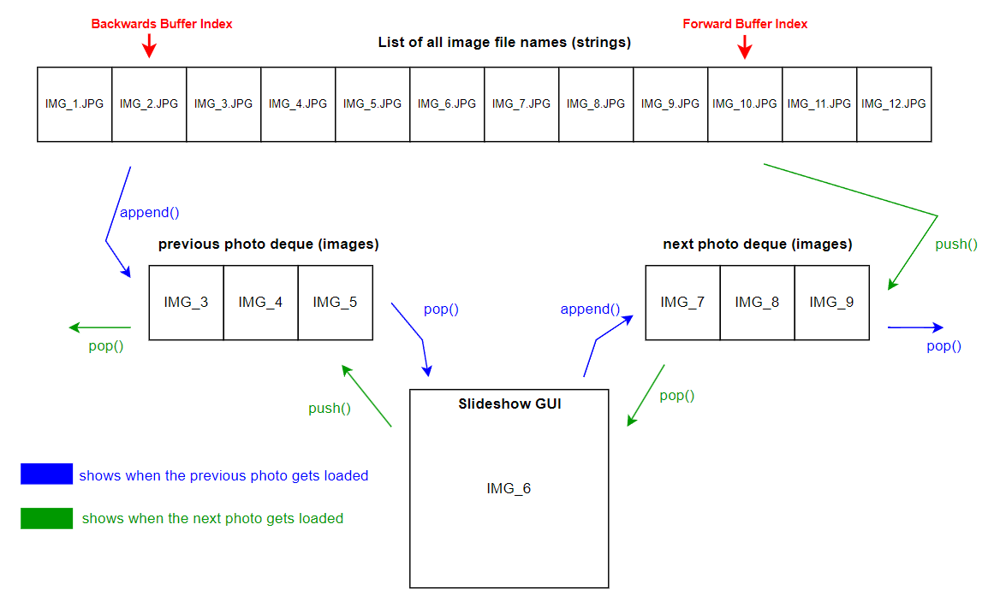

<h1 align="center">Simpler-Slideshow</h1>

  <strong>command line slideshow tool</strong> 
  A lightweight slideshow application originally designed for displaying family photos on a TV using a Raspberry Pi 
  <3

  <h3>
    <a href="#why-i-built-this">
      Why I Built This
    </a>
     | 
    <a href="#features">
      Features
    </a>
     | 
    <a href="https://github.com/AnthonyN3/simpler-slideshow/releases">
      Downloads
    </a>
     | 
    <a href="#controls">
      Controls
    </a>
     | 
    <a href="#compatibilities">
      Compatibilities
    </a>
  </h3>

## Why I Built This
This project originated as a practical solution for my parents to showcase cherished family photos in a dedicated, always-on display. The Raspberry Pi was the ideal hardware choice — energy-efficient, cost-effective, and easily configurable for headless operation.

With SSH and VNC enabled, and a reserved static IP via DHCP, the Pi can be accessed seamlessly over the local network. This allows for:

- Remote control of the slideshow and system behavior
- Effortless transfer of photos from any device without physical interaction 
	- made even smoother with the [Dynamic Photo Loading](#dynamic-photo-loading) feature

By leveraging the Pi's flexibility and minimal footprint, this setup creates an elegant, self-sustaining photo gallery, perfect for home environments :)

## Features

Simplicity and efficiency is the core feature. 😀  
But for a bit of extra polish, the app includes optional photo transformations, customizable display sequences, dynamic photo loading, and manual controls

### Buffered Photo Loading
To ensure smooth and responsive playback, the slideshow uses a dual-buffer system with two deques: one for upcoming photos and one for previously viewed ones. It preloads 5 future images into memory, enabling seamless transitions without lag. This approach strikes a balance between performance and memory efficience, allowing fast manual navigation without loading the entire image set into memory.

    
	Figure: Shows a basic diagram of how the dual buffer system works the a buffer size=3

### Photo Transformation

- **Resizing:** (Default): Scales images to best fit the display while preserving aspect ratio. Smaller images scale up, larger ones scale down. This may leave empty space around the image

- **Resizing & Cropping:** Fills the entire screen by first resizing and then center-cropping the image. The cropping is a center cropping, meaning it will crop an equal amount from both the left and right (or top/bottom).

> [!NOTE]
> I've noticed some window computers (mostly laptops) will have their default scale at 125% (found in `Display Settings`). If the scale is not 100%, then the photos will be slightly cut off

### Photo Sequence

- **Ordered:** The slideshow will cycle through the photos in the order, sorted by photo file name.

- **Randomized:** This will randomize the order the photos are displayed. Each photo will be displayed once until all photos are shown, then the photos are shuffled and the process repeats. No one photo will be shown more than another during a single loop. For example, if there are 5 photos loaded, then the sequence may look like:  `[4,2,5,1,3] -> [1,2,5,3,4] -> [3,4,2,1,5] -> etc`

### Dynamic Photo Loading

New photos can be added or removed while the app is running by simply updating the sounrce (photos) folder. At the end of each slideshow cycle, the program automatically rescans the folder to refresh the photo list, ensuring any changes are picked up without restarting the app.

> [!NOTE]
> This feature is currently only present in version [2.3.0-beta](https://github.com/AnthonyN3/simpler-slideshow/releases/tag/v2.3.0-beta)

### Background Color

You can change the color of the background. The background is the empty space the photo does not take up.

Current Supported Colors:
| Color | Description |
| :---: | :---: |
| `black` | ⚫ |
| `white` | ⚪ |
| `red` | 🔴 |
| `green` | 🟢 |
| `blue` | 🔵 |
| `cyan` | 🔵 |
| `yellow` | 🟡 |
| `magenta` | 🟣 |
| `hex value` | 🌈 |

## Controls
| Keys | Description |
| :---: | :--- |
| `SPACE` | pause slideshow|
| `↑` | speedup slideshow by intervals of 0.5sec |
| `↓` | slowdown slideshow by intervals of 0.5sec |
| `←` | previous photo |
| `→` | next photo |
| `F` | switch between fullscreen and windowed |
| `S` | show slideshow setting values |
| `ESC` | exit slideshow |

**Notes:**
> [!NOTE]
> If the slideshow is using randomization, the "previous photo" (←) control will halt once it reaches the first photo in its current loop. This is a design choice and is due to how the randomization was implemented. Read about the **randomized** function below.

## Compatibilities

The program currently supports the following image formats: JPEG, PNG, TGA, WEBP, BMP, and PSD. While most testing has been done with JPEG and PNG, the others should work as long as they are valid and readable by the PIL library. Note, I have hardcoded only the above to be accepted but chaning the code to accept others should in theory work fine.

The bundled executables are intended to run on both Linux and Windows systems. However, they’ve only been tested on a personal Windows machine and a Raspberry Pi. If the executable doesn’t work on your setup, you can always run the Python script directly—assuming your environment has the required dependencies.